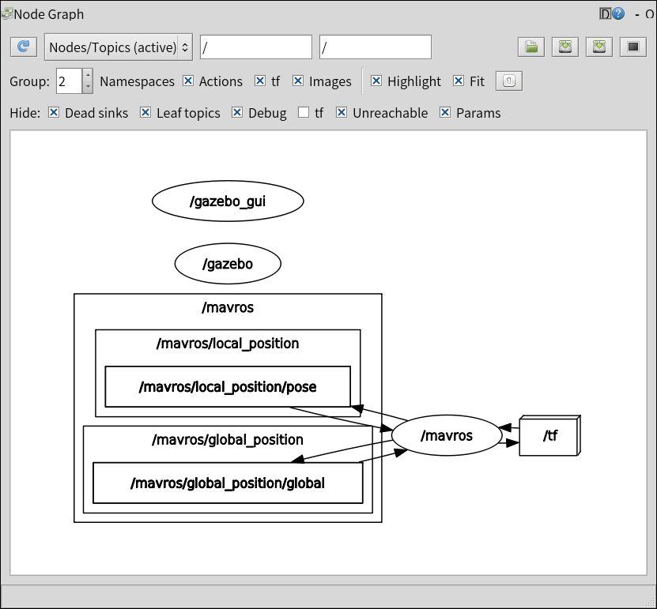

********************
The UAVF ROS Package
********************

The ``uavfpy`` package in ``main`` is a python package that does not depend on ROS. We do use ROS to orchestrate the mission, so we have a ROS package as well.

``uavfros`` is the name of the ROS package. Its development shares an issue tracker and repository with the main python package, but its development happens on the ``ROS`` and ``ROS-dev`` branches of the repository.

Installation
============

Prerequisites
`````````````
In order to develop packages on ROS, you need a PC equipped with Linux. Any desktop linux platform is suitable, but the easiest by far is Ubuntu. I prefer Ubuntu MATE on the desktop, but you can use a standard Ubuntu, KDE, or whichever flavor you like.

``uavfros`` is a ROS package. To install it, you need to have ROS installed and configured. That will not be covered in this documentation; if you are brand new to ROS, I recommend that you go through the ROS tutorial [1]_ before continuing to the next section.

.. note::
        
    In order to run Gazebo simulations, you need to have installed the "full" ROS environment. For example, with apt, you have installed ``ros-noetic-desktop-full``, not ``ros-noetic-ros-base`` or ``ros-noetic-desktop``.

This release targets ROS 1 Noetic, for compatibility reasons. We are not developing for ROS 2.

We assume that you have set up a catkin workspace in your home directory:

.. code-block::

    ~/catkin_ws

(Simulation) Install and Run PX4
````````````````````````````````

Follow this guide if you are planning to simulate a PX4 UAV mission.

This guide based on the `PX4 ROS1 Interface Guide <https://docs.px4.io/master/en/simulation/ros_interface.html>`_.

First, clone the PX4-SITL_gazebo repository into any directory. Make sure that you clone recursively and that you do not clone into your catkin_ws:

.. code-block:: bash

    cd ~/
    git clone --recursive https://github.com/PX4/PX4-Autopilot.git

Build the autopilot and make the SITL simulation available to ROS:

.. code-block:: bash

    cd ~/PX4-Autopilot
    DONT_RUN=1 make px4_sitl_default gazebo
    source ~/catkin_ws/devel/setup.bash 
    source Tools/setup_gazebo.bash $(pwd) $(pwd)/build/px4_sitl_default
    export ROS_PACKAGE_PATH=$ROS_PACKAGE_PATH:$(pwd)
    export ROS_PACKAGE_PATH=$ROS_PACKAGE_PATH:$(pwd)/Tools/sitl_gazebo

You will then see that `px4` is available to your roslaunch. Run:

.. code-block:: bash

    roslaunch px4 mavros_posix_sitl.launch

A gazebo window showing a quadcopter will open and the simulation will start. You will see a bunch of messages appear in the console window. Make sure you keep the console window open.

Inspect the rqt_graph:

.. code-block:: bash 

    rqt_graph

You will see several new nodes:



This is the simulated PX4, which can be commanded with MAVROS.

Install ``uavf``
`````````````````
.. warning::

    Because we are using this package from ROS, we need to ensure that we are NOT in any python virtual environment. You can verify this by typing ``which python`` into a terminal window. Make sure that the output is ``/usr/bin/python``.

Set up ROS:

.. code-block:: bash 

    source /opt/ros/noetic/setup.bash

Clone the git repository into ``~/catkin_ws/src`` and checkout the ``ROS`` branch. If you are developing ROS functionality, checkout ``ROS-dev``.

.. code-block:: bash

    cd ~/catkin_ws/src
    git clone https://github.com/uci-uav-forge/uavf
    git checkout ROS

Install the ``auvsi_suas`` interop client package and the ``uavf`` python package to your system python. There is a script that will do this.

.. code-block:: bash

    cd ~/catkin_ws/src/uavf/
    bash ./install_deps.sh

.. note::

    If, for some reason, you need to uninstall auvsi_suas from your system python, you can do so by running ``pip uninstall auvsi_suas``.

Run ``catkin_make`` and source your ``devel/setup.bash`` file:

.. code-block:: bash

    cd ~/catkin_ws
    catkin_make
    source devel/setup.bash

Make sure you remember to start a ``roscore`` instance in a separate terminal window.

Running a Mission with ``uavfros``
==================================

Until we have viable hardware testing, this section deals with running a simulated mission with ``uavfros``. 

Run ``uavfros`` Interop
-----------------------

The interop client is a ros node written in Python. We start it with ``rosrun``.

.. code-block::

    rosrun uavfros interop

Run ``uavfros`` Planner
-----------------------

The navigation node is a ros service node that will generate a new path for the UAV to follow between waypoints.

.. code-block:: bash

    rosrun uavfros planner


Run ``uavfros`` GNC
----------------

The uavf GNC node is a ros node that will take a computed plan and manage the execution of the plan on the UAV.

.. code-block:: bash

    rosrun uavfros gnc


.. [1] http://wiki.ros.org/ROS/Tutorials