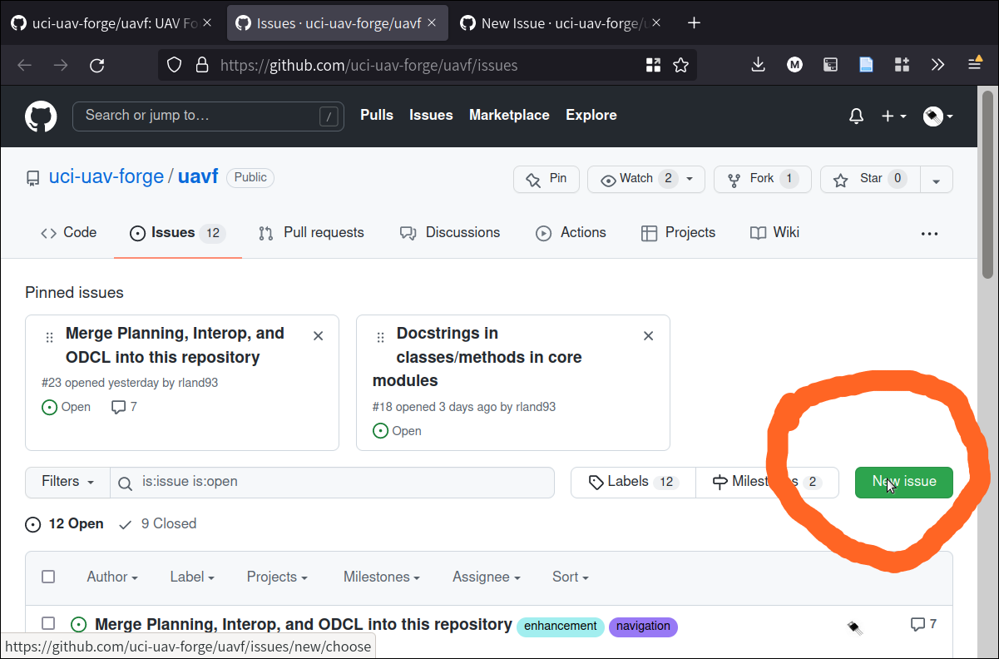
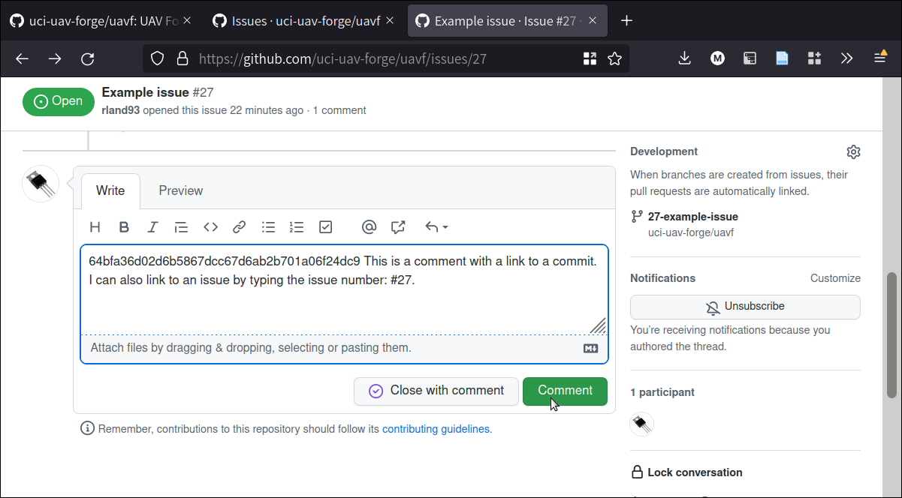
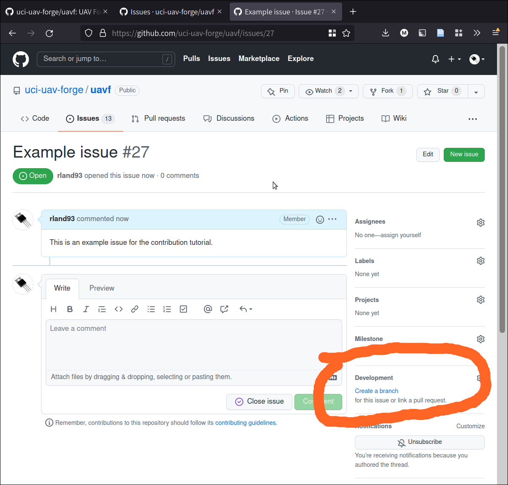

************
Contributing
************

This page is a guide to making contributions to the codebase.


Workflow
========

Useful to Know
--------------

The development workflow presumes some working knowledge of ``git``.  If you are brand new to ``git``, you may have these questions:

* *What is git? Branches, merging, commits? How do I install git?* → `Read the git-scm guide <https://git-scm.com/book/en/v2>`_

* *What is GitHub? What are issues and pull requests?* → `Read the github flow guide <https://docs.github.com/en/get-started/quickstart/github-flow>`_

How to make a Contribution
--------------------------

We are trying to make it so that adding contributions to the UAV Forge codebase is as easy as possible. We are also trying to use development tools that are in place across industry and academia. So: follow this guide! It's easy and well worth it.

1. You have an idea for a new feature, or you discover a bug that needs to be fixed.

2. Create a new issue. To do this, click on "issues" tab, and then go to "new issue." You can also review existing issues here.

.. image:: _static/contr01.png
    :width: 70%
    :align: center

On the issues tag, go to "New issue":



Write as much detail about your issue as you can. Remember that things you post in issues are public, so they will help other developers understand what you are working on or what bugs you have encountered.

When you're ready to post the issue, click "Submit new issue."

.. image:: _static/contr03.png
    :width: 70%
    :align: center

I submitted the issue and it was assigned #27. You can view it on Github:

`Issue #27 <https://github.com/uci-uav-forge/uavf/issues/27>`_

When your issue has been created, it becomes a new "board" where you can post discussion about the issue: your progress on solving it or implementation, implementation details or questions, and so on. You can tag other users with "@" to call attention to some part of the issue.

Often, you will make multiple commits on a feature branch. When making your commits, add the number of the issue in the commit message with a hastag.

In this example, I might make a commit referencing the issue:

.. code-block:: bash

    git commit -m "#27 Added images to contribution section"

Adding issue tags into commits helps link specific issues to specific commits, which helps other developers better understand how changes in the codebase are being made. I am going to commit some of the images I am adding to the branch, and tag them with the issue number I created here -- you can see that the commit I made showed up on the issue page!

Linking commits to issues is especially helpful, because if you click on the commit, you can exactly reproduce the state of the code from that commit. This helps other developers work collaboratively on the issue.

Let's make that commit...

Now that the commit is in, I can see the precise state of the code by clicking on the commit from in the issues page (If you're lazy to go there, `click here <https://github.com/uci-uav-forge/uavf/commit/64bfa36d02d6b5867dcc67d6ab2b701a06f24dc9>`_). This paragraph is not visible -- because when I made the commit I hadn't written it yet!

You can also link to commits easily by copying either a direct web link to the commit or a hash of the commit. In this case, the hash is:

64bfa36d02d6b5867dcc67d6ab2b701a06f24dc9

If I put that into a comment on the issue, I can link to the commit. This is the case for any commit in the codebase, even those outside of this particular issue. Feel free to try this out in issue #27.



Now, we have made our issue. When we start working on it, we want to create a branch from the repository. Typically, we want to branch from ``dev``, rather than ``main``. ``dev`` is the "working" branch of the codebase, and ``main`` is the "production" branch. Changes are usually made and integrated in the ``dev`` branch, and then when they really are ready, they go to ``main``.

We can create branches manually with git. It's a good idea to name branches with 1-3 summary words. It's also good practice to preface the branch with the issue number.

.. code-block::bash

    git branch 27-example-issue
    git checkout 27-example-issue

Github also includes a handy function to make branches from issues directly. They can then be pulled into the local repository:



If you use Github's functionality to do this, remember to branch from ``dev`` and not ``main``.

Then, we work on the issue. 

.. warning::

    Remember to commit only code to the repository! For guidelines, see :ref:`in-repository`.

When we are satisfied that our issue is completed, we submit a Pull Request. In essence, what we are doing is asking to merge our branch back into ``dev`` so that it can be integrated with the project.

On most open-source projects, only core maintainers can accept a pull request (sometimes abbreviated PR). It's not uncommon for pull requests to recieve lots of back-and-forth talk between core maintainers and contributors before they are accepted, and sometimes they are denied outright. Usually, though, pull requests are much appreciated!

.. _in-repository:
What should go into the repository?
===================================

* Code (``.py``)
* Scripts (``.py``, ``.sh``)
* documentation (``.rst``, ``.md``)

.. warning::

    What should *not* go into the repository?

    * Models (``.tflite``, ``.pb``, etc.)
    * Data (``.tfrecord``, ``.jpg``, etc.)
    * Example Files (``.jpg``, ``.mp4``, etc.)
    * Scripts that don't work
    * Failed Experiments

Rather than dumping non-code files into the repository, instruct the user how to acquire them. A good way to do this is to put the file in a publically-accessible link and include a script to download it. For example, I can upload a model to ``https://drive.google.com/some-public-link``, and then make a script called ``download-model.sh`` that has 

.. code:: bash 

    wget https://drive.google.com/some-public-link

Somewhere inside. 

We want to do this for any file that isn't code, like binary files, images, models, and so on. This ensures that the repository is as clean and readable as possible, which helps new maintaners understand the codebase.

Software Structure
==================

ROS
---

Working with ROS has some requirements that make it somewhat more difficult to work with than you may be used to. In particular, using ROS *requires* a Linux operating system. We have a few laptops with linux installed already, but we expect that most people aren't using linux natively and may not be used to working with the OS. So rather than making the entire piece of software dependent on linux to even run, we have separated the ROS-dependent code and the standard `core` code.

We also keep ROS code separate because `it's good practice to do so anyway <http://www.artificialhumancompanions.com/structure-python-based-ros-package/>`_. This is for several reasons, but it mostly has to do with how ROS is integrated with Python. In a nutshell, ROS always needs to use the system Python; even though standard Python development usually uses virtual environments to manage dependencies:

.. image:: https://imgs.xkcd.com/comics/python_environment_2x.png
    :width: 50%
    :align: center

So, to avoid development hell, we put the bulk of the functionality into the ``core`` branch, install ``core`` (and all of its dependencies) onto the vehicle's system python, and then we can just import the core package and use its funcationality in our ROS scripts.

The Golden Rule of ROS Development
``````````````````````````````````

So we have a golden rule about ROS development:

⚠️⚠️⚠️ ENCAPSULATE ⚠️⚠️⚠️

Always Always Always Encapsulate!

What do we mean?

An Example of What Not To Do
````````````````````````````

Let's say I want to add some feature to the imaging pipeline. It's something simple: it just reports the number of pixels in the image. I want to publish this data to a special ROS topic, so I'll do something easy, just put the function into the ros node:

.. code-block:: python

    import rospy
    from std_msgs.msg import Int32

    import numpy as np
    ...

    def count_pixels(image):
        return np.sum(image)

    ...

    def publish_pixels(image):
        pixels = count_pixels(image)
        rospy.loginfo(pixels)
        pub.publish(pixels)

    ...

    def main():

    ...

        rospy.init_node('pixels_counter')
        pub = rospy.Publisher('pixels', Int32, queue_size=1)
        rospy.Subscriber('image', Image, publish_pixels)
        rospy.spin()

Great! Let's just push to the ``ROS`` branch and commit. Sounds good, right?

⚠️⚠️⚠️ DO NOT DO THIS! ⚠️⚠️⚠️

Why not?

* Nobody can run, debug, or test this code if they don't have access to a ROS system.
* These changes will not be included in ``core``, so documentation will not be automatically generated for this method
* Someone working on ``core`` might never see this piece of code, so they might write their own ``count_pixels`` function
* Someone running ``pytest`` on the ``core`` branch will not be able to run the tests for this piece of code

Do This Instead
```````````````

Put this method somewhere in ``core``. Let's say in :py:mod:`pipeline`:

.. code-block:: python

    ...

    class Pipeline(object):
        
        ...
    
        def count_pixels(self, image):
            """Count the pixels of an image"""
            return np.sum(image)

Then, call it from the piece of code in the ``ROS`` branch.:

.. code-block:: python

    from Pipeline import pipeline

    def publish_pixels(pipeline, image):
        pixels = pipeline.count_pixels(image)
        rospy.loginfo(pixels)
        pub.publish(pixels)

    def main():
        pipeline = Pipeline(interpreter, .....)

        rospy.init_node('pixels_counter')
        pub = rospy.Publisher('pixels', Int32, queue_size=1)

        ...

        while True:

            ...
            [pipeline stuff]
            ...

            pub.publish(pipeline.count_pixels)

This difference is crucial to understand: the first way commingles ``core`` functionality with ROS code, making debugging and testing a nightmare. The second way keeps ``core`` functionality in ``core``, which allows everyone working on the codebase (not just the linux developers) to understand and debug it. 


Documentation
=============

We have attempted to make writing documentation as easy as possible -- and as close to the codebase as possible! This documentation contains documentation that people have written manually (such as this guide). This manual documentation is written in a format called reStructuredText, which is a commonly-used format for software documentation. To get started writing manual documentation with reStructuredText, read the `reStructuredText Primer <https://www.sphinx-doc.org/en/master/usage/restructuredtext/basics.html>`_.

The second type of documentation is the auto-generated documentation. This documentation is generated from in-line comments in the codebase. You don't need to touch anything in the `docs/` folder to write this documentation -- just comment your code, and your comments are added to the API page (:py:mod:`odcl`) automatically. The API page will rebuild itself automatically whenever pushes are made to the ``odcl/core`` branch of the repository. 

We use `Sphinx <https://www.sphinx-doc.org/en/master/index.html>`_ and a tool called `Sphinx Autoapi <https://github.com/readthedocs/sphinx-autoapi>`_ to automatically generate descriptions and API documentation for any class or method with a numpy-formatted docstring. This tool automatically parses the codebase.

.. note::

    The sphinx autodoc can only parse documentation if it is formatted with a ``numpydoc`` style:

    https://numpydoc.readthedocs.io/en/latest/format.html

    For an example of an (excessively) well documented function, see this example:

    https://numpydoc.readthedocs.io/en/latest/example.html#example

At a minimum, we try to document:

* The purpose of the function
* Function arguments and types
* Function returns and types

Building Documentation Locally
------------------------------

You can build a local copy of this documentation without making commits. That way, you can make changes and test locally before committing.

It requires a couple extra dependencies:

.. code-block:: bash

    pip install sphinx-rtd-theme sphinx-autoapi numpydoc

Then go to ``docs/`` and build HTML documentation:

.. code-block:: bash

    cd docs
    make html

Navigate to ``docs/build/html/index.html`` in your web browser to see the documentation. You will need to run ``make html`` to see your code changes reflected.

Running Tests
=============

We use `pytest <https://docs.pytest.org/en/latest/>`_ to run our tests.

Because the pipeline uses compiled tensorflow models and takes images as input, we need to download them before running tests that touch that functionality. So running tests is a two-step process. From the root of the repository;

First, download the models:

.. code-block:: bash

    bash ./prepare_tests.sh

This will download models and test images to ``tests/fixture_setup``.

Second, run the tests:

.. code-block::

    pytest

Tests with full resolution images can run very slowly (several minutes), because they perform inference on the CPU. These are skipped by default, but to run them, you can pass in the ``--slow`` flag to pytest:

.. code-block:: bash

    pytest --slow

Tests can be run with a TPU delegate instead of on the CPU. To run the tests with a TPU, you must have a TPU installed (they will fail if no TPU is detected.) Then, pass in the ``--tpu`` flag to pytest:

.. code-block:: bash

    pytest --tpu

Running tests with the ``--tpu`` flag WILL run "slow" tests -- those are not so slow when the TPU is used!

``pytest`` Flag Summary:
------------------------

=====================  ==================================
Flags                  Outcome
=====================  ==================================
``--tpu``              Runs slow tests on a TPU.
``--slow``             Runs slow tests on CPU.
``--tpu --slow``       Runs slow tests on a TPU and CPU.
No Flags               Runs only fast tests, only on CPU.
=====================  ==================================