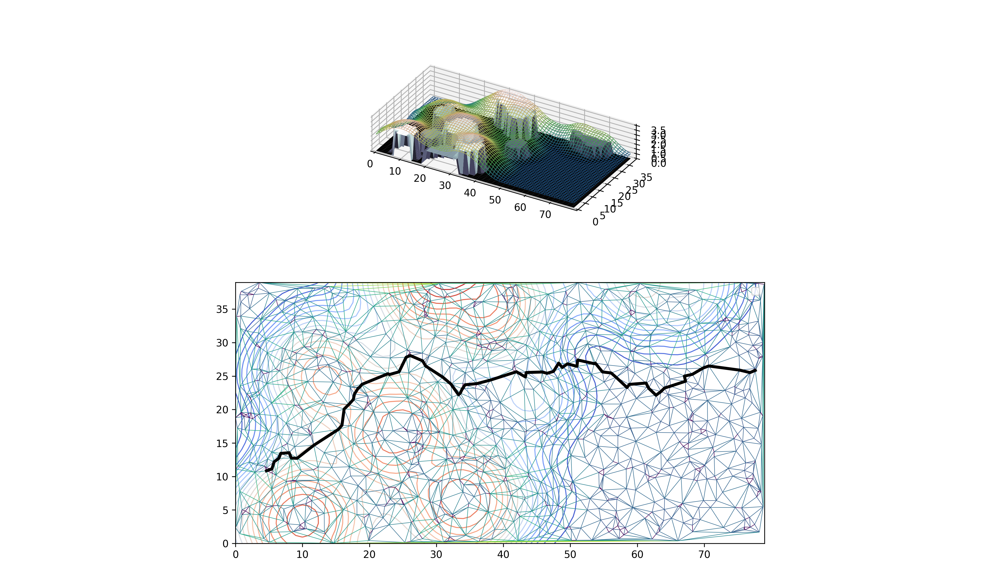
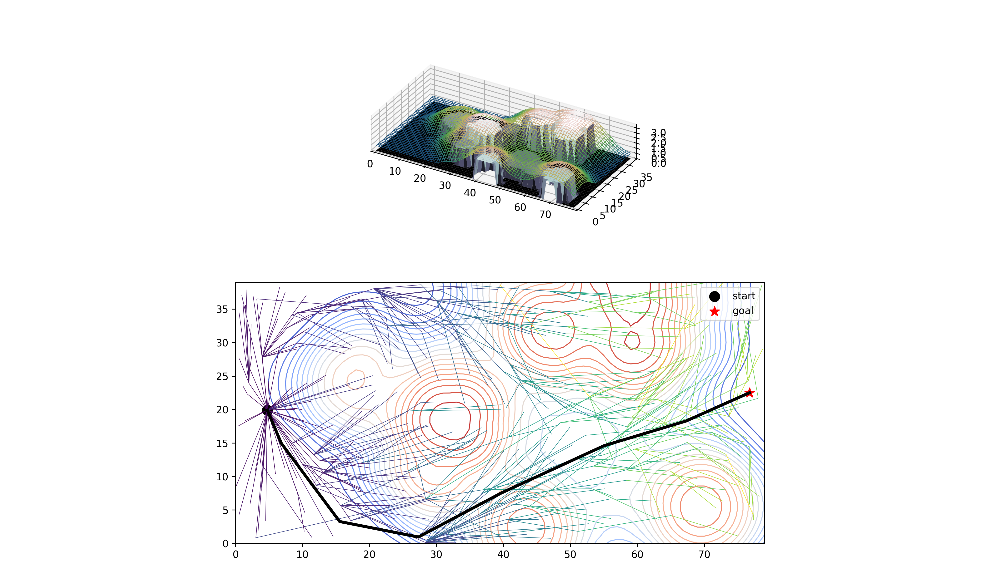

# Path Planner -- A collection of path planning algorithms in Python.

## Installation
```
pip install git+https://github.com/uci-uav-forge/pathplanner
```


# Package Components
+ bdc.py
    + Boustrophedon Decomposition (line sweep) algorithm
    + Reeb Graph construction
    + (EXPERIMENTAL) feasible path generation from Reeb Graph via Straight Skeleton
+ polygon.py
    + non-convex polygon generation 
    + 2d polygon (boundary) visualization
+ surface.py
    + generate surface to embed in R^3
    + optimally embed surface to minimize height, while:
        + clearing obstacles constraint
        + 1st, 2nd *x, y* derivative constraints
        + minimum height constraint
    + visualize surfaces in 2D with `matplotlib`
    + visualize surfaces in 3D with `matplotlib` (buggy)
    + visualize surfaces in 3D with `mayavi` -- requires `mayavi` installation
+ prm.py
    + generate PRM (Probabilistic Roadmap Planner) for embedded surface
    + PRM uses delaunay triangulation to compute edges
    + tunable cost function
    + visualize PRM with `matplotlib`
+ astar.py
    + generate A-Star planner for embedded surface
    + tunable cost function
    + visualize A-Star planner output
+ rrt.py
    + generate RRT (Rapidly Exploring Random Tree) planner for embedded surface
    + tunable cost function
    + visualize RRT with `matplotlib`

# Techniques

## Complete Coverage Planning:

We use boustrophedon decomposition to decompose an area (with or without holes) into a series of cells which can easily be swept for complete coverage. The world is given by a list of Mx2 arrays of outer boundaries and hole boundaries. Outer boundaries have to be given in clockwise order; hole boundaries must be given in counter-clockwise order.

## Polgyon Generation:

We generate random 2-D planar polygons (test worlds) for planning problems in R^2. The algorithm works as follows:

1. Get a random collection of points.
2. Triangulate the points.
3. Calculate triangles that are "safe" to remove (i.e., do not result in degenerate polygons or split polygons)
4. Remove the narrowest "safe" triangle.
5. Repeat $n$ times.
6. Get the points of the outer boundary and the hole boundaries
7. Order the points of each boundary using depth-first search.
8. Reverse (or not) the list of points depending on whether they belong to boundaries or not.
9. Return each labeled list of points; boundary points are CW, hole points are CCW.

# Example Images

### PRM Planner


The least-cost path, given by *g(**x1**, **x2**)*, is chosen, where *g* is a function that computes the cost based on least difference between ***x1*** and ***x2*** and ***x1***, ***x2*** are vectors in R^3. It's hard to visualize differences in paths, because longer paths tend to have much larger differences.

### RRT Planner


The cost function causes the tree to prefer routing around tall things rather than through them.

# Planned Features

+ Integrate `bdc` with `surface`
+ Allow holes in `surface` while maintaining smoothness
+ Update planners to deal with holes on the sheet
+ GPS coordinate conversion